# Claude Code — Source Analysis

> **This is Anthropic's real Claude Code CLI source**, extracted via an npm source map leak on **March 31, 2026**.  
> Discovered by [@Fried_rice (Chaofan Shou)](https://twitter.com/Fried_rice).  
> Analysis by [Muhammad Hanan Asghar](https://github.com/MuhammadHananAsghar).

> Static analysis only — the code cannot be compiled or run as-is.

---

## Authenticity

### Authentication Proof

| Evidence | Details |
|----------|---------|
| OAuth Client IDs | Hardcoded UUID: `9d1c250a-e61b-44d9-88ed-5944d1962f5e` (prod) |
| API Endpoints | `api.anthropic.com`, `platform.claude.com/v1/oauth/token` |
| Internal Domains | `.ant.dev` (Anthropic-only infra), `artifactory.infra.ant.dev` |
| Slack Channels | Multiple `anthropic.slack.com/archives/C0xxxxx` references |
| SDK | Uses `@anthropic-ai/sdk` with proper client initialization |

### Source Map Extraction Signature

1,679 of 1,884 `.ts` files use `.js` extensions in imports — the unmistakable fingerprint of source-map reconstruction. Normal TypeScript repos don't do this.

```typescript
// Example from the extracted code:
import { getOauthConfig } from '../constants/oauth.js'  // .js in .ts = source map extraction
```

### Feature Match — 100%

| Feature | Present |
|---------|---------|
| Tools (Read, Write, Edit, Bash, Grep, Glob, Agent) | ✅ 45 tools |
| Slash commands (/commit, /compact, /config, etc.) | ✅ 103+ commands |
| MCP server integration | ✅ |
| Remote sessions (bridge / CCR) | ✅ |
| Voice mode | ✅ |
| Vim mode | ✅ |
| Plan mode | ✅ |
| Worktree isolation | ✅ |
| Agent SDK | ✅ |

### Scale

| Metric | Value |
|--------|-------|
| Total files | 1,902 |
| Lines of TypeScript | 512,685 |
| Built-in tools | 45 |
| Slash commands | 103+ |
| MCP transport types | 6 |
| Internal feature flags | PROACTIVE, KAIROS, BRIDGE_MODE, DAEMON, VOICE_MODE |
| Missing (expected) | `package.json`, `tsconfig.json`, build config — not stored in source maps |

---

## Documentation Index

| Document | Description |
|----------|-------------|
| [Tools System](docs/tools-system.md) | Full tool interface, execution pipeline, permission architecture |
| [Tools List](docs/tools-list.md) | All 45 tools with inputs, descriptions, read-only/concurrency flags |
| [MCP System](docs/mcp-system.md) | Model Context Protocol — transports, OAuth, elicitation, plugins |
| [Memory System](docs/memory-system.md) | 4-tier memory, CLAUDE.md hierarchy, auto-dream consolidation |
| [Skills System](docs/skills-system.md) | SKILL.md-backed slash commands, prompt expansion pipeline |
| [Slash Commands](docs/slash-commands.md) | All 103+ slash commands with availability and descriptions |
| [Plan Mode System](docs/plan-mode-system.md) | 5-phase planning workflow, agents, approval flow |
| [Remote Sessions](docs/remote-sessions-system.md) | CCR bridge, WebSocket/SSE transports, worktree provisioning |
| [API Endpoints](docs/api-endpoints.md) | All 68 HTTP/WebSocket endpoints with auth and headers |

---

## Architecture Overview

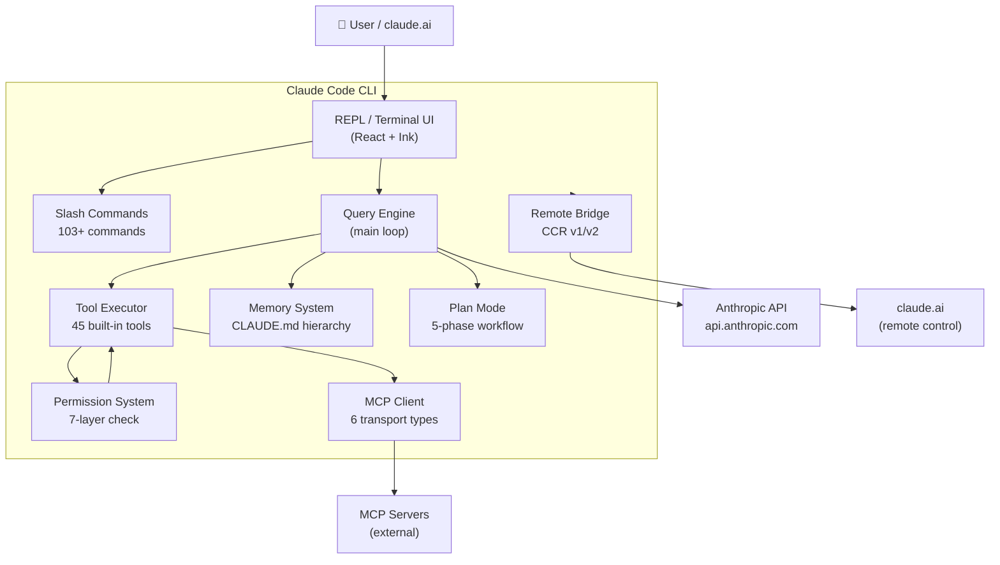

---

## Tool Execution Flow

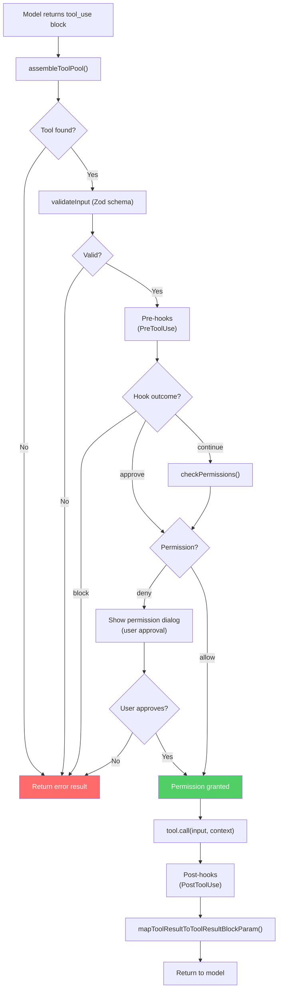

---

## Permission System (7 Layers)

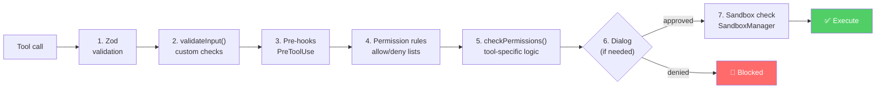

---

## MCP Flow

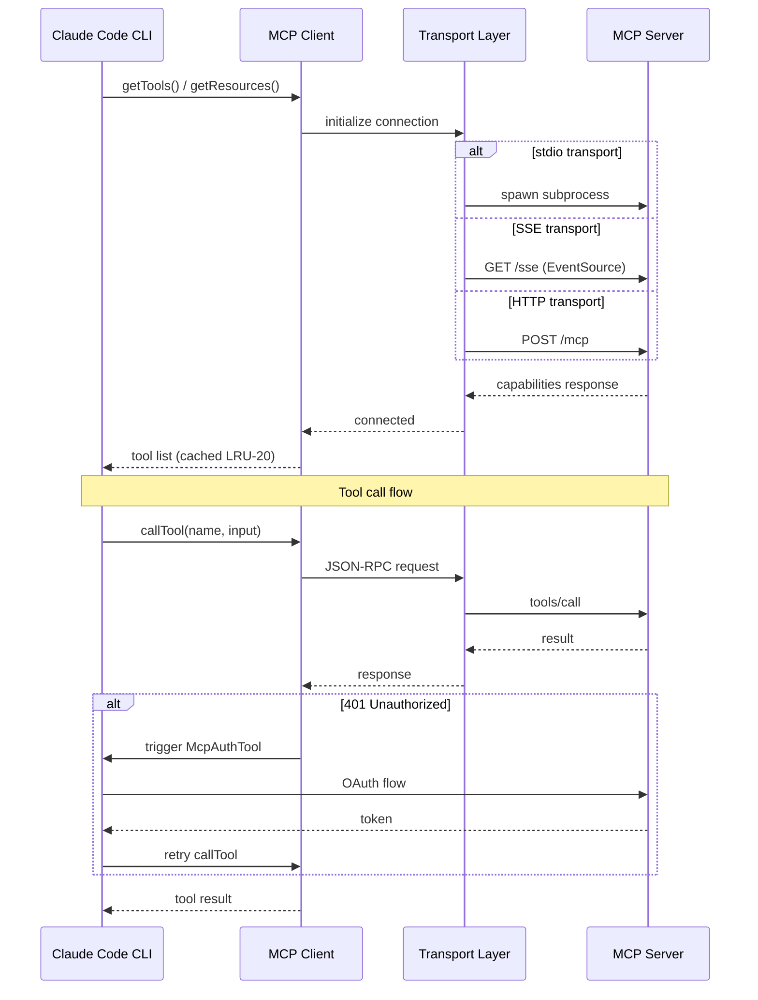

---

## MCP Transport Types

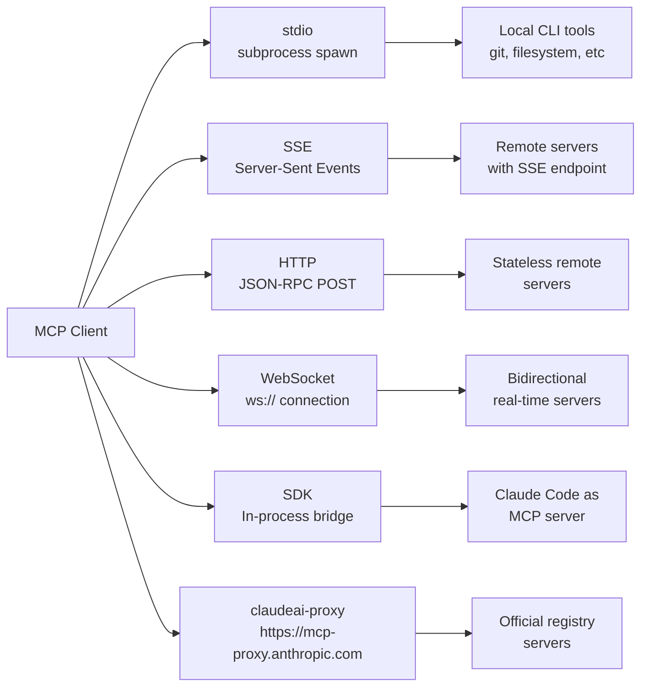

---

## Memory System

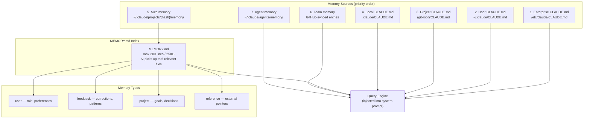

---

## Plan Mode Flow

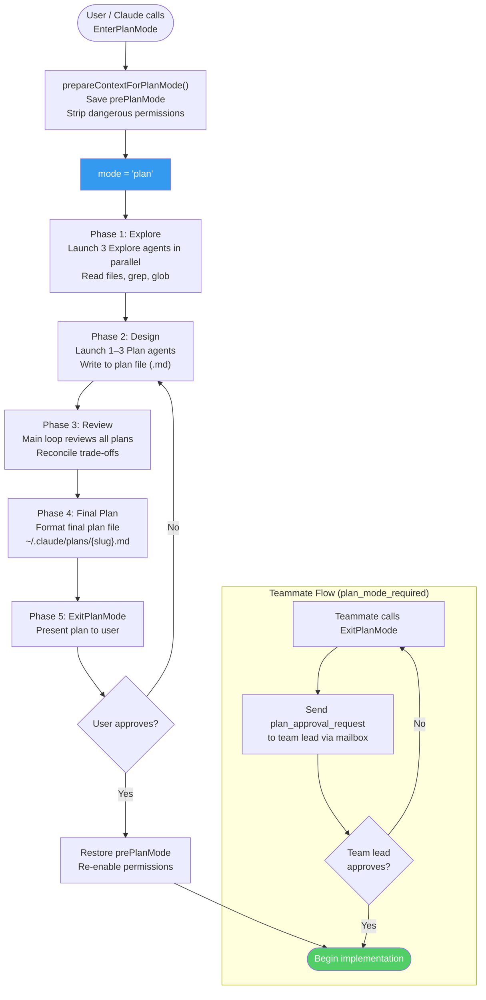

---

## Remote Sessions (CCR) Flow

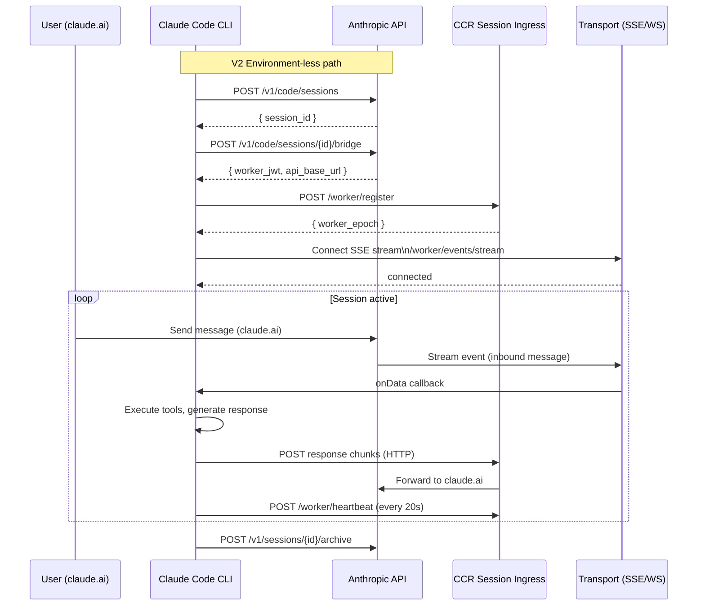

---

## Remote Sessions Transport Selection

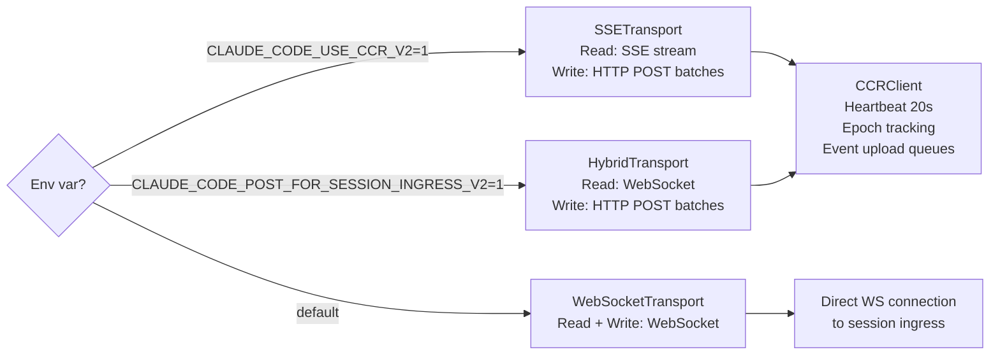

---

## Skills / Slash Command Resolution

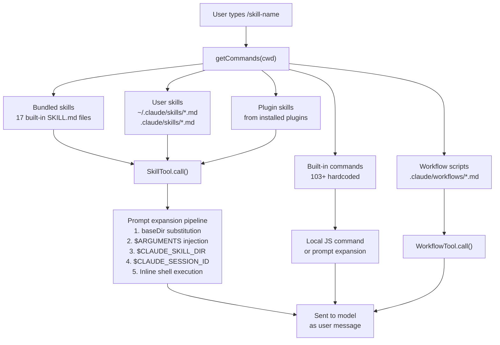

---

## OAuth Authentication Flow

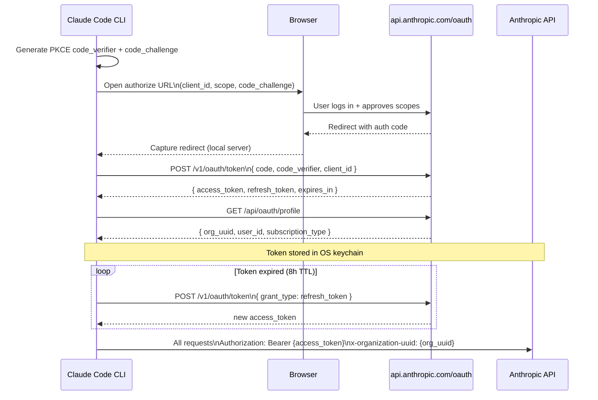

---

## Agent System

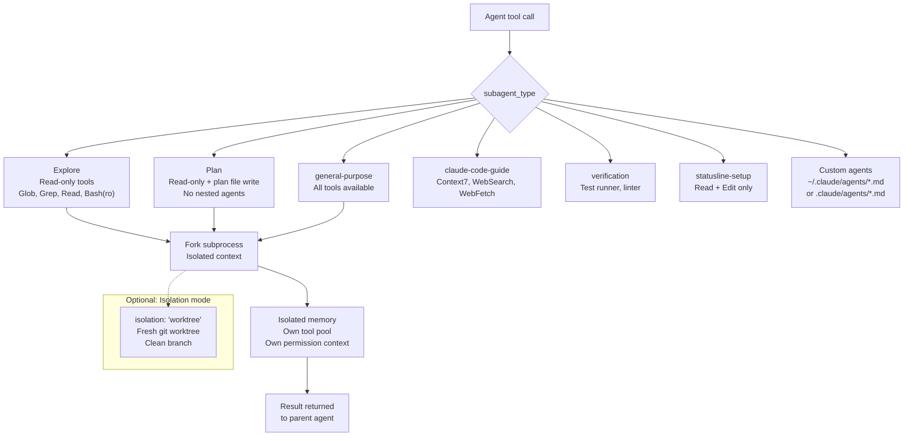

---

## Security Architecture

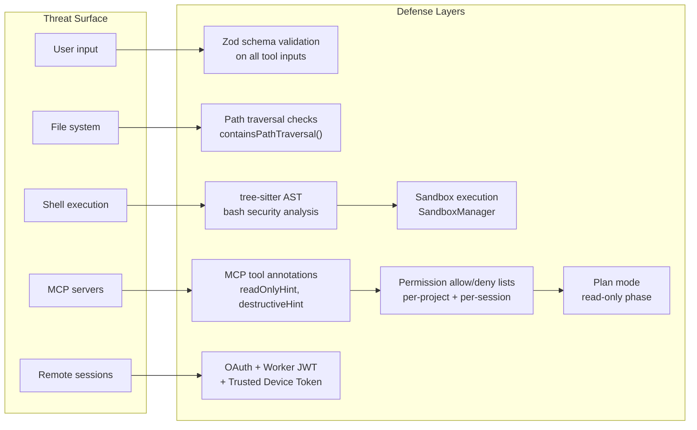

---

## Codebase Structure

```
src/
├── tools/              # 45 built-in tools (one dir per tool)
├── commands/           # 103+ slash commands
├── services/
│   └── mcp/            # MCP client, transports, auth
├── bridge/             # Remote sessions (CCR v1/v2)
├── cli/
│   └── transports/     # WebSocket, SSE, Hybrid transports
├── upstreamproxy/      # CONNECT-over-WebSocket tunnel
├── utils/
│   ├── permissions/    # Permission system
│   ├── plans.ts        # Plan file management
│   ├── worktree.ts     # Git worktree provisioning
│   └── teamMemory.ts   # Team memory sync
├── skills/             # Bundled SKILL.md files
├── types/              # Shared TypeScript types
├── components/         # React/Ink terminal UI components
├── constants/          # OAuth config, feature flags
└── entrypoints/        # CLI, MCP server, bridge daemon
```

---

## Key Internal Feature Flags

These `bun:bundle` compile-time flags gate entire subsystems:

| Flag | Unlocks |
|------|---------|
| `KAIROS` | Channels mode (Telegram, Discord, Slack bots) |
| `BRIDGE_MODE` | Remote control daemon + `/bridge` command |
| `VOICE_MODE` | Voice input/output |
| `PROACTIVE` | Proactive suggestion system |
| `DAEMON` | Background daemon process |
| `ULTRAPLAN` | Extended ultra plan mode |
| `FORK_SUBAGENT` | `/fork` conversation branching |
| `WORKFLOW_SCRIPTS` | `.claude/workflows/` script runner |
| `TRANSCRIPT_CLASSIFIER` | Auto permission mode via transcript analysis |
| `TEAMMEM` | Team memory sync |
| `TORCH` | Internal Anthropic workflow |
| `BUDDY` | Buddy agent mode |
| `UDS_INBOX` | Unix socket peer-to-peer inbox |

---

> **Disclaimer:** This repository contains source code obtained through a source map leak in Anthropic's npm package distribution. It is published here for security research and educational purposes only.
